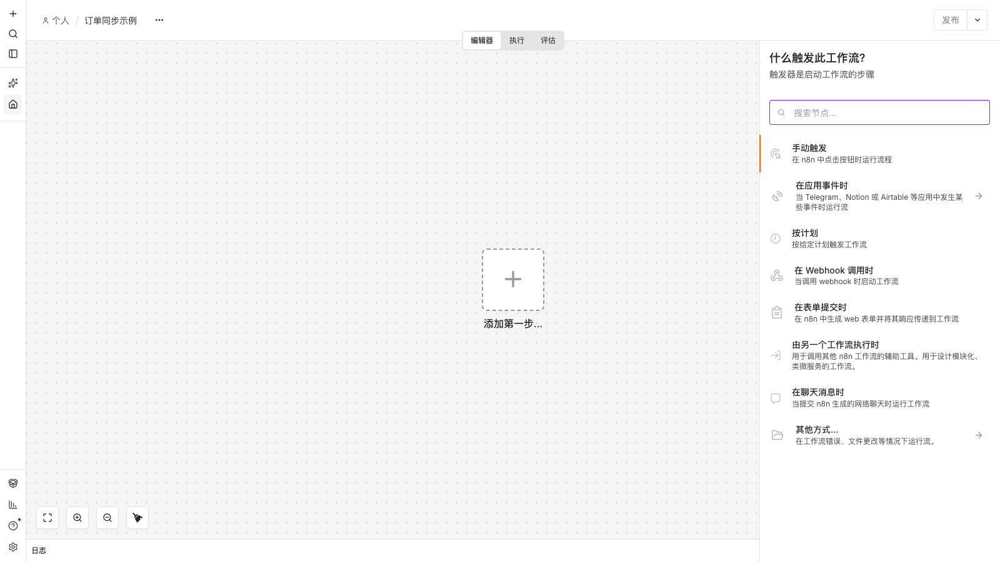

<div align="center">

# n8n 简体中文汉化包

**让 n8n 说中文 —— 开箱即用的简体中文界面，CI 全自动跟随官方发版**

[](https://github.com/bsi-bcp/n8n-i18n-chinese/releases)
[](https://github.com/n8n-io/n8n/releases)
[](https://github.com/bsi-bcp/n8n-i18n-chinese/actions/workflows/node.js.yml)
[](LICENSE)

```shell
docker pull swr.cn-north-4.myhuaweicloud.com/bcphub/n8n-chinese:2.40.7
```

</div>

> 社区延续维护 [fork](https://github.com/other-blowsnow/n8n-i18n-chinese)（原项目已归档停更）：将 zh-CN 语言包编译进 editor-ui，**上游 n8n 发新版后数小时内自动跟进发版**。当前覆盖 **n8n 2.40.7**（词典 9723 键全量汉化）。
>
> 非 n8n 官方项目；n8n® 为 n8n GmbH 商标，n8n 本体受 [Sustainable Use License](https://docs.n8n.io/license/)（fair-code）约束；汉化包本身 MIT（© imblowsnow + BSI，经原作者授权），详见[版权与来源声明](#版权与来源声明)。



## ✨ 特性

- 🔄 **全自动跟进上游** — watcher 每小时巡检 n8n 官方稳定版，评估通过后自动完成「增量翻译 → 覆盖率门禁 → 构建 → Release → 镜像推送」，上游发新版通常当天即有对应汉化，不用再苦等停更的汉化包
- 📖 **不只翻菜单** — 9723 键界面词典全量汉化；节点面板的节点描述（568 节点）与操作标题（580 条）一并汉化；Data tables 等弹窗硬编码英文标签已修复；节点参数面板中文化已随镜像分发（如 Slack「发送消息」面板全中文）
- 🐳 **镜像即所得** — 官方 n8n + 汉化 editor-ui 合一镜像，amd64 / arm64 双架构，默认中文界面，一条 `docker run` 用起来
- 🔓 **公开免登录** — 华为云 SWR 公开仓库，匿名 `docker pull`，不注册、不登录、无门槛
- 🧰 **部署形态齐全** — Docker / Docker Compose / Queue Mode 集群（同版本配套 runners 镜像）/ 官方镜像挂载 dist / npm·npx 本地替换 / 内网离线导入，全有现成步骤
- 📜 **授权清晰** — MIT 许可（原作者书面授权延续维护），SUL 合规声明与第三方依赖许可清单随包分发

## 📦 交付物

| 交付物 | 获取方式 |
|---|---|
| 🐳 **中文 Docker 镜像**（推荐） | `swr.cn-north-4.myhuaweicloud.com/bcphub/n8n-chinese:<版本号>`（华为云 SWR，amd64 + arm64，内置中文界面） |
| 🔧 **Task Runners 镜像**（Queue Mode 用） | `swr.cn-north-4.myhuaweicloud.com/bcphub/n8n-runners:<版本号>`（同版本配套，公开拉取） |
| 📦 **editor-ui 部署包** | 本仓库 [Releases](https://github.com/bsi-bcp/n8n-i18n-chinese/releases) 附件 `n8n-editor-ui@<版本号>.tar.gz`（bind mount 覆盖用） |

版本选择见下方「[n8n 版本兼容说明](#n8n-版本兼容说明)」。

## 🚀 快速开始

> 仓库为公开拉取属性，**无需任何登录**，直接 pull 即用（2026-09-19 实测匿名可拉全部版本）。

**Docker 一条命令：**

```shell
docker run -d --name n8n \
  -p 5678:5678 \
  -v ~/.n8n:/home/node/.n8n \
  swr.cn-north-4.myhuaweicloud.com/bcphub/n8n-chinese:2.40.7
```

**或 Docker Compose：**

```yaml
services:
  n8n:
    image: swr.cn-north-4.myhuaweicloud.com/bcphub/n8n-chinese:2.40.7
    restart: unless-stopped
    ports:
      - "5678:5678"
    volumes:
      - ~/.n8n:/home/node/.n8n
    environment:
      - GENERIC_TIMEZONE=Asia/Shanghai
```

打开 `http://localhost:5678` 即为中文界面；`curl http://localhost:5678/healthz` 返回 200 即健康。

> 💡 想切回英文？设 `N8N_DEFAULT_LOCALE=en` 即可 —— 中文镜像只是默认 zh-CN，不锁定语言。
>
> ⚠️ 生产部署请走 HTTPS（反代终止 TLS），此时 cookie 安全位默认开启；仅本机试玩用 http 访问 localhost 时，才需要临时加 `-e N8N_SECURE_COOKIE=false`。

## 📖 安装方式

### 方式一：中文 Docker 镜像（推荐）

镜像 = 官方 n8n + 汉化 editor-ui，默认中文界面，开箱即用。具体命令见上方[快速开始](#-快速开始)；生产部署建议 HTTPS 反代 + 数据卷持久化（`/home/node/.n8n`）。

### 方式二：官方镜像 + 挂载汉化 dist

适合已在跑官方镜像、只想加中文的场景；`【替换为下载的编辑器UI目录】` = Releases 部署包解压出的 `dist/` 目录。其他命令参考 n8n 官方文档。

```shell
docker run -it --rm --name n8ntest \
-p 15678:5678 \
-v 【替换为下载的编辑器UI目录】:/usr/local/lib/node_modules/n8n/node_modules/n8n-editor-ui/dist \
-v ~/.n8n:/home/node/.n8n \
-e N8N_DEFAULT_LOCALE=zh-CN \
-e N8N_SECURE_COOKIE=false \
n8nio/n8n
```

> ⚠️ `blowsnow/n8n-chinese` 为原上游作者的镜像，**已停止更新（停在 n8n 2.33.7）**，本仓库不再向该地址发布；老用户请迁移到方式一。

### 方式三：npx / npm 本地安装（替换 dist）

适合用 npx / npm 全局方式跑 n8n 的用户：

1. 定位本机 `n8n-editor-ui/dist` 目录（Windows 常见两个位置）：
   - npx 缓存：`C:\Users\<用户名>\AppData\Local\npm-cache\_npx\n8n\node_modules\n8n-editor-ui\dist`
   - npm 全局安装：`C:\Users\<用户名>\AppData\Roaming\npm\node_modules\n8n\node_modules\n8n-editor-ui\dist`
2. 下载对应版本的部署包 `n8n-editor-ui@<版本号>.tar.gz`，解压覆盖到该 `dist` 目录
3. 设置环境变量后重启 n8n：`N8N_DEFAULT_LOCALE=zh-CN`
   - PowerShell：`$env:N8N_DEFAULT_LOCALE="zh-CN"`　·　CMD：`set N8N_DEFAULT_LOCALE=zh-CN`　·　Linux/macOS：`export N8N_DEFAULT_LOCALE=zh-CN`

### Queue Mode 集群

除 main/worker/webhook 外，还需一个 **Task Runners 容器**执行 Code 节点——用同版本配套镜像 `swr.cn-north-4.myhuaweicloud.com/bcphub/n8n-runners:<版本号>`（公开拉取，免登录）。⚠️ runners 与 n8n 后端**版本必须严格一致**，不可混搭。

## 🔁 升级

```shell
# ① 备份
cp docker-compose.yml docker-compose.yml.bak && tar czf n8n-data-backup.tgz ~/.n8n
# ② 改镜像版本号（chinese 与 runners 同步改成同一个新版本号）
# ③ 拉取并生效
docker compose pull && docker compose up -d
# ④ 验证：/healthz 200 + 打开界面看中文 + 关键工作流试运行一条
```
（Queue Mode 集群：main/worker/webhook 与 runners 四个服务**一起**改版本号。）

### 升级注意事项（必读）

- **升级前**：备份 compose 文件与数据卷；对照上方兼容矩阵确认目标版本
- **minor 跨级**（如 2.39.x → 2.40.x）会执行数据库迁移，官方不支持直接降级——回滚须 `n8n db:revert`（一次回退一步）后再回旧镜像，或建议前滚修复
- **社区节点**：n8n 2.38.4 起不再向社区节点提供内置模块（`ajv`/`axios`/`glob` 等），升级后社区节点可能报 `Cannot find module`，需在节点包内补装依赖（详见排障指南第 6 条）
- **中文界面**：升级 n8n 后端的同时，把汉化镜像/部署包一起升级到同版本号即可，无需额外操作

## 📡 离线部署（内网 / air-gapped）

内网环境拉不到镜像时，**不要用部署包 tar.gz 冒充镜像**（那是前端文件不是镜像）。正确做法：任选一台有网机器拉取后导出再拷入内网：

```shell
docker pull swr.cn-north-4.myhuaweicloud.com/bcphub/n8n-chinese:2.40.7
docker save swr.cn-north-4.myhuaweicloud.com/bcphub/n8n-chinese:2.40.7 | gzip > n8n-chinese.tar.gz
# 拷入内网后：
docker load < n8n-chinese.tar.gz
```
（也可向我们索取现成的镜像离线包。）

## n8n 版本兼容说明

> 选型原则：**editor-ui dist 版本与 n8n 后端版本保持一致**。汉化包只替换前端静态文件，不碰后端、数据库与配置——patch 级替换/回滚仅改版本号；minor 跨级升级/回滚须按 Release 说明执行数据库迁移/回退（`n8n db:revert`）。

| n8n 后端版本 | 推荐汉化包 | 获取渠道 | 说明 |
|---|---|---|---|
| ≤ 2.33.7 | 与后端**精确匹配**的版本 | [上游 Release](https://github.com/other-blowsnow/n8n-i18n-chinese/releases)（已归档停更） | 旧版 editor-ui 对版本敏感，错位可能白屏 |
| 2.34 ~ 2.38.6 | `release/2.39.6`（首选）或 `release/2.38.7` | 本仓库 Releases | 实测可用（2.38.4 / 2.38.7 后端实证）；新 dist 配旧后端安全 |
| 2.38.7 | `release/2.38.7`（精确匹配）或 `release/2.39.6` | 本仓库 Releases | 8341 条全量汉化 |
| **2.39.0 ~ 2.39.6** | **`release/2.39.6`（精确匹配）或 `release/2.39.7-v3`（就近，YTJ1 实测）** | 本仓库 Releases / 镜像 | 8372 条全量汉化，AI 助手新界面含中文；镜像 `swr.cn-north-4.myhuaweicloud.com/bcphub/n8n-chinese:2.39.6`（已回填 SWR） |
| **2.39.7** | **`release/2.39.7-v3`（精确匹配）** | 本仓库 Releases / 镜像 | 9374 键全量汉化（含 v2 术语大修）+ 节点面板第二/三层汉化（568 节点描述 + 456 操作标题）+ Data tables 等弹窗硬编码标签修复；镜像 `swr.cn-north-4.myhuaweicloud.com/bcphub/n8n-chinese:2.39.7`（v3 内容，已回填 SWR） |
| **2.39.8** | **`release/2.39.8`（精确匹配）** | 本仓库 Releases / 镜像 | 9522 键全量汉化（补丁版，词典沿用 v3 + 上游 AI Assistant 预览修复随版带入）；镜像 `swr.cn-north-4.myhuaweicloud.com/bcphub/n8n-chinese:2.39.8`。**2026-09-21 以修复后管线重建**（EE 合规清理，重建前后镜像 digest 已变更） |
| **2.39.9** | **`release/2.39.9`（精确匹配）** | 本仓库 Releases / 镜像 | 9519 键全量汉化；首版构建于 EE 清理前旧管线，**同日以修复后管线重建**（上游锚定 SHA 见 Release 说明） |
| **2.39.10** | **`release/2.39.10`（精确匹配）** | 本仓库 Releases / 镜像 | 9519 键（上游零前端变更补丁版，dist 与 2.39.9 逐字节一致）；首个完整走修复后管线（EE 四层门禁）的全自动发版 |
| **2.40.0 ~ 2.40.4** | **`release/2.40.5`（就近）** | 本仓库 Releases / 镜像 | 同 minor 旧补丁线，新增文案回退英文；2.40 为 minor 版，跨级升级/回滚须按 Release 说明执行数据库迁移/回退 |
| **2.40.5** | **`release/2.40.5`（精确匹配）** | 本仓库 Releases / 镜像 | 9723 键全量汉化（较 2.39 线新增 204 条文案 + 上游 2.40 前端全量重建）；2.40 线首个汉化版 |
| **2.40.6** | **`release/2.40.6`（精确匹配）** | 本仓库 Releases / 镜像 | 9723 键；补丁版（上游实例报告鉴权修复），dist 微调 |
| **2.40.7** | **`release/2.40.7`（精确匹配，最新）** | 本仓库 Releases / 镜像 | 9723 键；补丁版（上游 OpenTelemetry span 属性修复），词典零增量、dist 与 2.40.6 逐字节一致 |
| > 2.40.7 | 就近低版本 dist 搭配 | 本仓库 Releases | 等本仓库跟进发版（CI 自动）；期间新文案回退英文，功能不受影响 |

补充规则：

- dist 与后端小版本不一致时，**优先“dist 略新于后端”而不是“dist 旧于后端”**——新 dist 对旧后端只是多几个用不到的文案；旧 dist 对新后端则新界面全是英文
- n8n 升级后若出现**白屏**，说明 dist 与后端差异过大，请换就近匹配的版本
- n8n 官方发新版本后，本仓库会跟进构建对应汉化包并发布到 Releases

## 🔒 安全与透明度

给「敢不敢用」一个明确的答案——改了什么、怎么构建的，全部公开可审计：

- **改动范围最小**：只替换 n8n 的前端静态文件（editor-ui dist），注入 zh-CN 词典并注册语言；不改动后端代码、数据库结构与配置逻辑
- **全部改动可查**：源码级改动 = [`patches/`](patches/) 下公开补丁 + [`script/`](script/) 下构建脚本，GitHub 上逐行可读
- **构建过程公开**：每版产物均由 GitHub Actions 公开流水线产出（自动翻译 → 词典覆盖率门禁 → 编译 → Release → 镜像推送），构建日志任何人可查，任意版本可按仓库步骤自行复现
- **许可合规**：SUL Notices 修改声明、第三方依赖许可清单（[THIRD_PARTY_LICENSES.md](THIRD_PARTY_LICENSES.md)）随部署包与镜像一并分发

## 💬 错译反馈与技术支持

常见问题（白屏 / 拉取 401 / 界面部分英文 / Code 节点失败 / 升级数据库报错）先看 **[排障指南](docs/排障指南.md)**。

发现界面译文错误（错译/漏译/术语不统一）时，任选其一：
1. 到 [Issues](https://github.com/bsi-bcp/n8n-i18n-chinese/issues) 提交，注明：**界面位置（截图最佳）+ 当前译文 + 建议译文**
2. BSI 交付客户也可通过您的交付顾问 / 客户服务群反馈（内部转交评审登记）

所有反馈进入翻译评审表登记，随下个版本修复（高频问题可发 hotfix 词典）。

## 🧩 工作原理

> n8n editor-ui 内置 vue-i18n 且支持多语言，但官方未发布中文语言包。

1. 将 `zh-CN.json` 注入 n8n 源码的 i18n 语言包目录（`packages/frontend/@n8n/i18n/src/locales/`），打补丁注册语言后重新编译 editor-ui
2. 环境变量 `N8N_DEFAULT_LOCALE=zh-CN` 生效中文（镜像已默认设置）

CI 链路：watcher 每小时巡检官方稳定版 → 增量翻译 → 覆盖率门禁 → 构建 → Release → 镜像推送，细节见仓库 `.github/workflows/` 与 [CHANGELOG](CHANGELOG.md)。

参考：[n8n 官方 i18n 文档](https://github.com/n8n-io/n8n/blob/master/packages/frontend/%40n8n/i18n/docs/README.md) · [语言代码规范](https://developer.mozilla.org/en-US/docs/Web/HTTP/Headers/Accept-Language)

## 🌍 English

Community-maintained **Simplified Chinese localization** for the n8n editor UI — continuation of the [archived upstream](https://github.com/other-blowsnow/n8n-i18n-chinese) project. CI rebuilds automatically for every n8n stable release (currently covering **n8n 2.40.7**, 9723 translated keys).

```shell
docker run -d --name n8n -p 5678:5678 -v ~/.n8n:/home/node/.n8n \
  swr.cn-north-4.myhuaweicloud.com/bcphub/n8n-chinese:2.40.7
```

The image defaults to Chinese UI (`N8N_DEFAULT_LOCALE=zh-CN`); set `N8N_DEFAULT_LOCALE=en` to switch back to English. Public Docker registry — no login required. Localization is MIT-licensed; n8n itself remains under its own [Sustainable Use License](https://docs.n8n.io/license/).

## 版权与来源声明

- 本仓库 fork 自 [other-blowsnow/n8n-i18n-chinese](https://github.com/other-blowsnow/n8n-i18n-chinese)（原作者 **imblowsnow**，该项目已于 2026-08-21 归档停更，最终版本 `release/2.33.7`）。
- 原项目的全部内容（翻译词典、脚本、补丁、文档）版权归原作者所有。原作者 imblowsnow 已于 2026-09-14 在 [issue #67](https://github.com/other-blowsnow/n8n-nodes-feishu-lite/issues/67) 中书面授权「**允许继续修改和分发继承的翻译词典、脚本与补丁**」（授权原话已书面存档）；MIT 为本 fork 选定的落地协议，授权人未异议。另致谢原仓库贡献者 tqjason / Sini0r 等（其词典贡献的授权核验与处理已一并书面存档）。本仓库据此补充 [LICENSE](LICENSE) 文件，其中完整保留原作者的版权声明。
- 本仓库为社区延续维护 fork：在原项目停止维护后，继续跟进 n8n 新版本的简体中文翻译。通过 GitHub Release、Docker 镜像等渠道分发的构建产物同样适用上述 MIT 授权（n8n 本体除外，见下条）。
- n8n 本体为 [Sustainable Use License](https://docs.n8n.io/license/)（fair-code），本项目的语言包为其界面文案的社区翻译，n8n 的使用须遵守其自身许可。
- **修改声明（SUL Notices 条款合规）**：本仓库产物（editor-ui dist / 节点包 dist / 汉化镜像）为 n8n 的**本地化修改版**，修改范围 = 注入 zh-CN 语言包并注册语言、节点面板文案查表、前端少量硬编码文案源码级替换、n8n-nodes-base 与 @n8n/n8n-nodes-langchain 两包参数面板显示串的构建期中文替换（**不含任何 "\*.ee.\*" 专有文件与 EE 节点内容**，该等内容不适用 SUL、本项目不修改）；未删除或遮盖 n8n 的任何许可与版权声明（含页脚许可链接）。n8n® 为 n8n GmbH 商标，本项目与 n8n 官方无隶属关系、亦非官方背书。
- **翻译准确性声明**：本项目中文译文（词典与参数面板译串）由机器翻译辅助生成，经抽样评审与社区反馈回路持续修正，仅供界面显示参考；参数含义、功能行为与配置口径请以 n8n 英文原文及[官方文档](https://docs.n8n.io/)为准。错误与日志类消息保留英文原文，便于对照官方文档与社区检索排障。
- **第三方依赖许可清单**：[THIRD_PARTY_LICENSES.md](THIRD_PARTY_LICENSES.md)（取自上游 n8n 对应版本 Release 的同名附件，原文照录）随部署包（dist 内同目录）与中文镜像（`/usr/local/lib/node_modules/n8n/THIRD_PARTY_LICENSES.md`）一并分发；各依赖包的完整 LICENSE 亦随 n8n 发行物的 `node_modules/` 原样分发。
- 本仓库在 fork 之后新增或修改的内容（构建脚本、文档、翻译增补等）版权归维护方（商软信息 BSI）所有，一并以 MIT 协议授权，见 [LICENSE](LICENSE)。

## ⭐ 支持这个项目

- 觉得有用就点个 **Star** ⭐ —— 让更多被英文界面劝退的 n8n 中文用户找到这里
- 发现错译欢迎提 [Issue](https://github.com/bsi-bcp/n8n-i18n-chinese/issues)：每一条反馈都会进评审表，随下个版本修复
- 欢迎把项目分享给你的团队和社区（技术群、教程、博客均可；镜像与部署包可直接引用）
