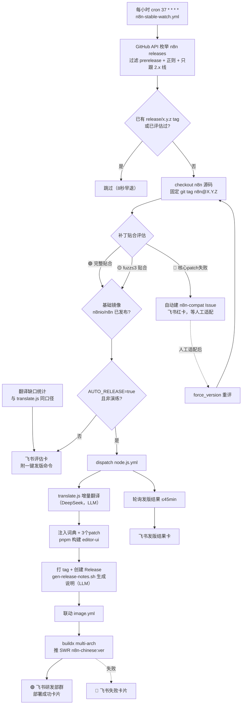
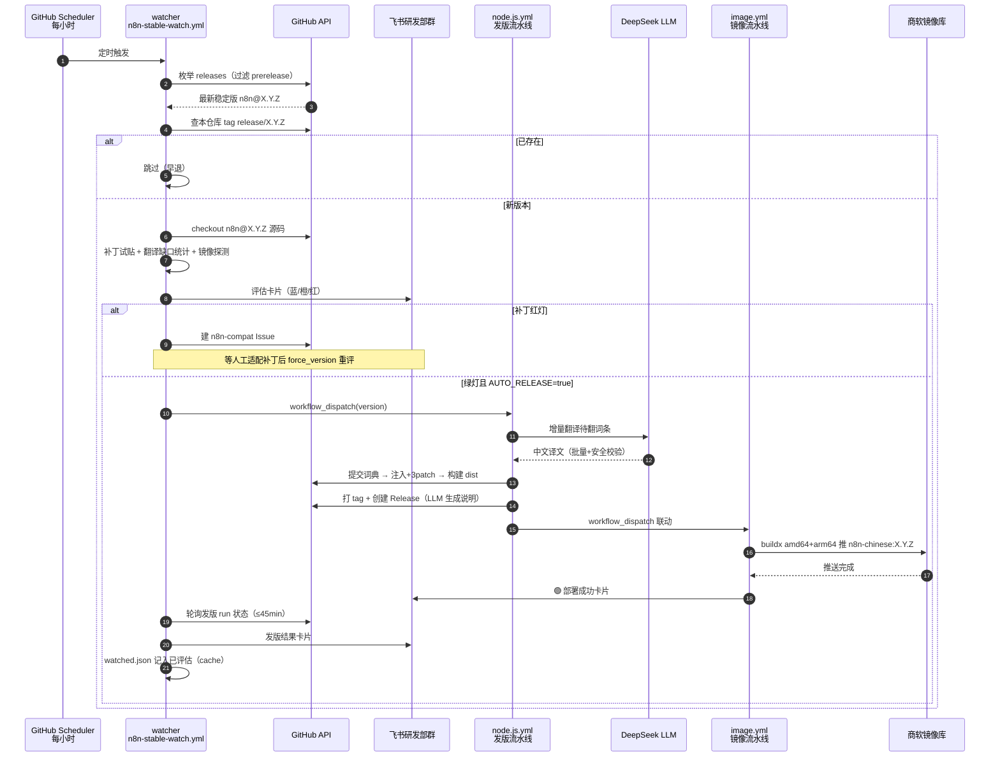

# n8n 汉化自动化工作流介绍

> 日期：2026-09-18 ｜ 状态：**实战运行**（2.39.7 v2 起 CI 全链验证，当晚 `AUTO_RELEASE=true` 开启全自动）
> 组成：`n8n-stable-watch.yml`（监控评估）→ `node.js.yml`（翻译构建发版）→ `image.yml`（镜像交付），外加 `feishu-pr-notify.yml` / `feishu-security-notify.yml` 两个辅助通知。
>
> 📢 **2026-09-19 更新速记**（2.39.8 全自动首发当日）：① 镜像交付渠道迁移华为云 SWR `swr.cn-north-4.myhuaweicloud.com/bcphub/n8n-chinese`（旧库冻结为存量服务）；② image.yml 升级 v3——构建源改 Release 资产下载（不依赖 tag 内容），`--output oci-mediatypes=false,compression=gzip` 过 SWR 兼容（buildx 默认 OCI+zstd 被拒），版本白名单支持 `-vN`；③ 产物命名规则落地——部署包 `n8n-editor-ui@<版本号>.tar.gz`（Release 标题同名）、`-vN` 只进 tag；④ node.js.yml dist 提交前 `rm -rf`（修复嵌套污染）；⑤ CodeQL paths-ignore 忽略 editor-ui-dist + init 显式 config-file（误报 130→0）。下文正文保留 2026-09-18 原貌，与速记冲突处以速记为准。

## 一、这套流水线解决什么问题

n8n 官方持续发版，而官方 editor-ui 不含中文。本仓库要把「发现新版 → 判断能否汉化 → 翻译 → 构建 → Release → 镜像 → 通知」整条链自动化，人工只在**补丁无法自动贴合**时介入适配。最终交付物三路一致：

| 交付物 | 渠道 | 消费方 |
|---|---|---|
| `n8n-editor-ui@<版本号>.tar.gz`（旧名 editor-ui-<ver>.tar.gz） | GitHub Release 部署包 | bind mount 实例（品牌定制类，如 YTJ1） |
| `n8n-chinese:<ver>` 镜像 | `swr.cn-north-4.myhuaweicloud.com/bcphub`（华为云 SWR，amd64+arm64；2026-09-19 起取代 registry.bcpcloud.cn） | 客户边端整体交付（.env 改版本号即升级） |
| 词典与 patch | 仓库 main 分支 | 下一次构建的输入 |

## 二、流程工作原理

### 2.1 阶段一：发现新稳定版（n8n-stable-watch.yml，每小时）

- **触发**：`cron: "37 * * * *"`（错峰避开整点高峰）+ `workflow_dispatch`（人工入口，可传 `force_version` 演练 / `report_only` 只报告）。
- **版本解析（评审修订 D1）**：GitHub API 枚举最近 40 个 release → 过滤 draft/prerelease → 正则 `^n8n@X.Y.Z$` → **只跟本插件当前大版本线**（从本仓库已有 `release/x.y.z` tag 推断主版本，当前 2.x）→ 取排序后最新。
- 演练模式（force_version）强制 semver 白名单校验（防注入），评估结果不写入状态。

### 2.2 阶段二：门禁（避免重复劳动）

按序短路，命中即退出（运行只有 8 秒）：
1. 本仓库已存在 `release/<ver>` tag → 已发过，跳过；
2. `state/watched.json`（actions/cache 持久化的状态机）已记录评估过 → 跳过。

### 2.3 阶段三：三项确定性评估（无 LLM，纯 shell/jq）

| 评估项 | 方法（评审修订号） | 结论 |
|---|---|---|
| 补丁贴合（D4） | checkout 上游 `n8n@<ver>` 源码，对每个 patch `git apply --check`；失败降级 `patch -p1 --fuzz=3 --dry-run` 试贴 | 🟢完整贴合 / 🟡模糊贴合 / 🔴无法贴合（**核心 patch `feat__i18n_zhCn.patch` 失败才判红**，其余 patch 失败只报告） |
| 翻译缺口（D3） | 拉上游该版本 `en.json`，与本仓库 `script/en.json`（旧基准）、`languages/zh-CN.json` 三方对比，与 translate.js 完全同口径统计 | 新增 / 源变更 / zh 缺失 / 待翻总数 |
| 基础镜像 | 探测 Docker Hub `n8nio/n8n:<ver>` tag 是否已发布 | 决定能否立即自动发版 |

### 2.4 阶段四：发版决策（阶段开关）

| 结论 | 条件 | 动作 |
|---|---|---|
| 自动发版 | 补丁非红 + `AUTO_RELEASE=true`（仓库变量）+ 非演练 + 基础镜像已发布 | `gh workflow run node.js.yml -f version=<ver>`，并轮询结果最长 45 分钟 |
| 等待确认 | 绿/黄灯但开关未开或镜像未出 | 飞书卡片附一键发版命令 |
| 需人工 | 红灯 | 自动建 `n8n-compat` Issue（同版本查重）+ 飞书红卡，人工适配补丁后 `force_version` 重评 |

> 镜像未发布时该版本**不入 watched 状态**，下轮自动重评——「等待下轮」承诺由状态机兑现（2026-09-18 修复）。
> ⚠️ 现行逻辑**黄灯（模糊贴合）也会自动发版**，卡片会提示人工复核补丁内容；如需黄灯也停，改 watcher 的 Auto release 步骤条件即可。

### 2.5 阶段五：发版流水线（node.js.yml，完整包模式）

入参 `version`（watcher 传入或人工），链路：

1. **翻译**：`translate.js` 以同版本 tag 的上游 en.json 为源（N8N_EN_JSON_URL pin tag，评审 D2），DeepSeek 增量翻译（batch=15），提交词典（`chore: auto translate`）；
2. **词典覆盖率门禁**：统计 zh 缺失键，>0 自动补翻一轮（瞬时故障自愈），补后覆盖率 <99% 阻断发版（堵住 LLM API 耗尽时静默带病发版的零告警缺口）；
3. **注入与补丁**：checkout n8n 源码（固定 git tag）→ 拷入 zh-CN.json → 依序应用三个 patch（`feat__i18n_zhCn` 注册语言 / `feat__node_creator_actions_i18n` 节点面板操作标题 / `fix__hardcoded_labels` 弹窗硬编码+描述符冻结）；
4. **构建**：`pnpm install --frozen-lockfile` + 构建 editor-ui（CI Ubuntu/Node 22，2.39.8 实测全链可过）；
5. **发布**：打包 dist → **先提交 dist 再 `git rebase origin/main` 后打 tag**（根除「构建窗口内 main 的 workflow 提交进 tag 历史被拒」竞态；GITHUB_TOKEN 无 workflows scope 可授，workflow 里声明即整文件 startup_failure——双实锤）→ 打 `release/x.y.z` tag → 创建 GitHub Release，说明由 `gen-release-notes.sh` 生成（LLM 总结上游 changelog，失败自动降级原文）；
6. **联动**：以 `workflow_dispatch` 触发 image.yml；`if:failure()` 飞书红卡与 watcher 轮询红卡双保险。

### 2.6 阶段六：镜像流水线（image.yml，2026-09-19 起 v3）

- dispatch/release 触发 → 版本 semver 白名单校验（支持 `-vN` 后缀，镜像 tag 取基础版本号）→ **checkout main 取 Dockerfile（ghcr 基础镜像源）+ 下载该版本 Release 资产作 dist** → **docker buildx multi-arch（amd64+arm64）**，`--output oci-mediatypes=false,compression=gzip` 推 `swr.cn-north-4.myhuaweicloud.com/bcphub/n8n-chinese:<ver>`（SWR 拒收 buildx 默认 OCI+zstd 输出）；
- **推送成功 → 飞书研发部群绿卡**（版本/镜像 tag/两种交付方式/Release 链接）；**失败 → 红卡**（常见原因提示）。同版本重发=覆写镜像 tag，边端拉取流不变。

### 2.7 通知与告警

全部卡片走 `FEISHU_WEBHOOK` = **飞书研发部群**；完整告警体系（流水线告警 + 协作告警 + 安全告警 + 静默设计）见「五、告警与提醒体系」。

### 2.8 人工介入点（全链唯一需要人的场景）

| 场景 | 动作 |
|---|---|
| 补丁红灯（上游重构 i18n/index.ts 等） | 手动做等效修改 → 重新生成 patch → 三补丁齐放并 grep 标记验证 → `force_version` 重评 |
| 黄灯复核（可选） | `patch --fuzz` 贴合的 patch 人工确认语义 |
| 开关切换 | `gh variable set AUTO_RELEASE --body "true/false"` |
| LLM 断供换源 | 更新 Secrets/Variables（`OPENAI_API_KEY`/`OPENAI_API_BASE`/`OPENAI_MODEL`），失败版本下轮自动重试 |

## 三、流程逻辑图



## 四、时序图（自动发版全链 + 红灯分支）



## 五、告警与提醒体系

> 设计原则：**事件驱动推卡片，不打扰则静默**；所有卡片经飞书自定义机器人 webhook 投递到研发部群，投递后校验响应 `code:0`（未确认成功打 workflow warning，不阻塞主流程）。

### 5.1 流水线告警（发版链路自身的健康监控）

| 时机 | 卡片颜色 | 触发 workflow | 内容要点 |
|---|---|---|---|
| 新版本评估完成 | 蓝（绿）/橙（黄）/红（补丁红灯） | n8n-stable-watch | 三项评估明细、结论、一键发版命令、运行链接 |
| 自动发版结果 | 绿成功/红失败 | n8n-stable-watch | 发版 run 结论 + 日志链接（轮询 ≤45 分钟） |
| 镜像推送成功（=部署交付物就绪） | 绿 | image.yml | 版本、镜像 tag（amd64+arm64）、两种交付方式、Release 链接 |
| 镜像构建/推送失败 | 红 | image.yml | 版本、常见原因（凭证过期/基础镜像未发布/产物缺失）、日志链接 |
| 补丁红灯需人工 | — | n8n-stable-watch | 自动建 `n8n-compat` Issue（含适配指引与重评命令）+ 飞书红卡 |

投递可靠性：卡片 jq 程序必须先本地验证结构（曾实测拦截 `elements` 被挤出 card 对象的括号错误）；发送响应 `code:0` 才算送达。

### 5.2 协作告警（feishu-pr-notify.yml）

- 监听 PR 全生命周期（opened / reopened / synchronize / ready_for_review / closed / merged），推卡片：标题、作者、分支、head SHA、合并状态；
- **静默规则**：草稿 PR 不打扰（除非被直接关闭），`ready_for_review` 时恢复提醒——避免 WIP 阶段刷屏。

### 5.3 安全告警（feishu-security-notify.yml，每小时 13 分）

- 轮询仓库 **code-scanning alerts**（CodeQL）API，以 actions/cache 状态机做**新告警去重**——只推增量，不重复轰炸；
- 权限收敛：仅 `security-events: read`（write 可被利用伪造扫描结果，评审 #10 修复）；
- Dependabot 告警策略：可选配只读 fine-grained PAT（`GH_ALERTS_TOKEN`）直接轮询；留空则依赖「自动修复 PR → PR 通知」兜底（无修复方案的告警不会被推送）；
- 提供 `full_backfill` 入参：首跑/验证连通性时把现存未处理告警全量推一遍。

### 5.4 静默设计（防止告警疲劳）

| 场景 | 行为 |
|---|---|
| 版本已发布/已评估 | watcher 8 秒早退，**不推任何卡片** |
| 演练评估（force_version） | 卡片标注【演练】，结果不入状态 |
| 草稿 PR | 静默 |
| 安全告警已推送过 | 状态机去重，不重推 |

### 5.5 周边基础设施告警（与本仓库相关，属其他系统）

- **n8n 实例运行告警**：各边端实例中央错误流（errorWorkflow）→ feishu-proxy 中转 → 飞书告警群（见 skill:bcp-deploy-n8n）；
- **FRP 隧道入侵监控**：TX-43 高频扫描双阈值自动封禁 + 推送研发群（见 skill:bcp-frp）；
- **registry 凭证**：BCP_REGISTRY_* 过期会导致镜像红卡（卡片内已列为常见原因提示）。

## 六、安全设计

- **注入防护**：所有外部输入（force_version / release tag / API 返回）一律经 env 进入 shell 并强制 semver 白名单校验，不做表达式内插；
- **最小权限**：watcher `contents:read + issues:write + actions:write`（dispatch node.js.yml 必需）；node.js.yml `contents:write + actions:write + workflows:write`（tag 历史可能携带 main 上的 workflow 提交）；第三方 action 全部 SHA-pin；
- **可复现决策**：发版判定为确定性规则（试贴/计数/探测），LLM 只承担翻译与摘要两类生成任务，且摘要失败自动降级原文不阻塞发版。

## 七、运维速查

```bash
# 手动评估指定版本（演练，不入状态）
gh workflow run n8n-stable-watch.yml -f force_version=2.40.1 -R bsi-bcp/n8n-i18n-chinese

# 只评估报告不自动发版（临时覆盖开关）
gh workflow run n8n-stable-watch.yml -f report_only=true -R bsi-bcp/n8n-i18n-chinese

# 人工一键发版（跳过等待）
gh workflow run node.js.yml -f version=2.40.1 -R bsi-bcp/n8n-i18n-chinese

# 切换全自动 / 半自动
gh variable set AUTO_RELEASE --body "true"   # 或 "false"

# 只重推镜像（Release 已存在时）
gh workflow run image.yml -f version=2.39.7 -R bsi-bcp/n8n-i18n-chinese
```

## 八、实战记录

| 日期 | 事件 |
|---|---|
| 2026-09-17 | 监控评估方案评审（8.1/10），修订 D1-D7 为 v2 |
| 2026-09-18 早 | 2.39.7 v2：watcher 评估 → 人工 dispatch → CI 全链构建 → Release → 镜像联动，首战验证通过 |
| 2026-09-18 晚 | v3（节点面板汉化）本地构建发版并合并 v1/v2 Release；`AUTO_RELEASE=true` 开启全自动；image.yml 增部署成功飞书绿卡（首次 dispatch 实测拦截卡片 jq 括号错误，修复后重发 `code:0` 送达）；同日修复 HEAD 上 actions patch 缺 const i18n 的漏提交隐患 |
| 2026-09-18 | 2.39.8 首次全自动发版实战，连环暴露三缺陷并当日全修：①dispatch 403 静默假绿（GITHUB_TOKEN 缺 `actions:write`，且绿灯卡先发、红卡条件不满足、失败仍入 watched）→ 补权限 + dispatch 失败必出红卡 + 失败不入状态下轮重试；②绿灯但基础镜像未发布会入状态致「等待下轮」承诺落空 → 该场景不入状态；③补权限后二跑构建成功但 tag 推送被 GitHub 拒收（构建窗口内 main 的 workflow 提交经 rebase 替换后进入 tag 历史，GITHUB_TOKEN 无 `workflows` 权限）→ 补 `workflows:write`。同日新增：词典覆盖率门禁（缺失>0 自动补翻一轮，补后 <99% 阻断发版）、node.js.yml `if:failure()` 飞书红卡、红灯 Issue 查重（cache 逐出防重帖） |
| 2026-09-18 续 | `workflows:write` 被证伪：GITHUB_TOKEN 不支持该 scope，声明即整文件 startup_failure（0s 失败运行），并连锁使 dispatch 403——watcher 的「dispatch-failed 红卡 + 不入状态」机制首次实战即正确兜底。遂将 node.js.yml 收窄为补丁包模式（翻译+覆盖率门禁+补丁包 tar 附件+Release），并发布 `release/2.39.8` 补丁包 |
| 2026-09-18 定型 | **用户决策恢复完整包自动化**（构建完整 n8n 汉化包；补丁包 Release 与 tag 删除后重建）。node.js.yml 恢复全链构建，保留全部当日加固（actions:write / 覆盖率门禁 / 失败红卡 / 先提交 dist 再 rebase 后打 tag / 不声明 workflows scope）；watcher 恢复镜像门禁。2.39.8 完整包人工 dispatch 重建，watcher 的 dispatch-failed 红卡机制当日已实战验证一次正确兜底 |

维护细则见仓库 `CLAUDE.md`（runbook / patch 注意事项 / 提取脚本）。

## 九、高频问答（2026-09-18 实战答疑）

### Q1：如何判断一个汉化版本要发布？满足什么条件才发？

**版本选取**（watcher 每小时）：枚举 n8n 官方 releases，过滤非 draft / 非 prerelease / tag 匹配 `n8n@x.y.z`，只跟随本插件当前大版本线（取本仓已有 `release/x.y.z` tag 的最大主版本），在过滤结果中按 semver 取最新。

**门禁早退**：本仓已有 `release/<T>` tag（已发过）或 watched.json 已记录（已评估过）→ 8 秒跳过，不发卡。

**三项评估**：

| 项 | 判定 | 是否阻塞 |
|---|---|---|
| 补丁贴合 | `git apply --check` 逐个试贴；✅→绿，🟡fuzz≤3 可过→黄，❌全失败→**只有 `feat__i18n_zhCn.patch` 判红** | **红阻断**；`fix_editor-ui.patch`（仅 ≤2.33 需要）与 `.old` 同列忽略，不参与门禁 |
| 翻译缺口 | 与 translate.js 同口径三方对比 | **不阻塞**（node.js.yml 内置增量翻译自动补） |
| 基础镜像 | DockerHub `n8nio/n8n:<ver>` 存在性 | **必须已发布**，否则等待下轮（不入 watched 状态，下轮自动重评） |

**自动发版 6 条件**（全满足才 dispatch node.js.yml）：未早退 ∧ 补丁非红 ∧ 镜像已发布 ∧ `AUTO_RELEASE=true` ∧ 非 report_only ∧ 非 drill。红灯 → 建 `n8n-compat` Issue（同版本查重），人工适配后 `force_version` 重评。

### Q2：中间过程失败（比如翻译时 LLM token 耗尽）会发飞书研发部群告警吗？

分两类：

- **硬失败**（任一步非零退出）：**双保险**——node.js.yml 自身 `if:failure()` 直接发红卡；watcher 每 60s 轮询其结论，拿到 failure 也发红卡「❌ 发版流水线结果：failure，需人工介入」。dispatch node.js.yml / image.yml 失败本身也必发红卡（`dispatch-failed`）。watcher 侧红卡是 2026-09-18 之前唯一的通道（单点），node.js.yml 红卡为当日补强。
- **软失败**（LLM API 全挂但 translate.js 退出 0）：translate.js 对失败条目只记日志跳过、进程正常退出 0——修复前会**静默带病发版零告警**；现有词典覆盖率门禁兜底：缺缺失>0 自动补翻一轮，补后覆盖率 <99% 阻断发版 → 转化为硬失败 → 红卡。带病交付这条路已堵死。

已知边界：watcher 轮询上限 45 分钟，构建超时会报 timeout 红卡（构建实际可能仍在跑并最终成功——告警存在但可能误报）；watcher job 自身 60 分钟超时被杀则无结果卡（概率低，GH UI 有记录）。

### Q3：如果 LLM token 耗尽，是如何翻译的？

translate.js 内建三级韧性：429 退避 5s 重试 → 批量失败二分降级重试（拆半直到单条）→ 最终仍失败记日志跳过（不写入词典，下轮按「zh 缺失」自动补翻）；发版门禁还会先自动补翻一轮消化瞬时故障。但 **token 真耗尽无法自动换源**——需要人工在仓库 Secrets/Variables 换供应商（`OPENAI_API_KEY`/`OPENAI_API_BASE`/`OPENAI_MODEL`，当前主用 DeepSeek，备用清单见 CLAUDE.md），下个整点自愈。断供期间发版被门禁阻断（红卡），不会带病交付。

### Q4：GitHub 是否可以提供翻译功能？

- GitHub 本体**没有**翻译服务；Marketplace 上的翻译 Action 全是第三方 API（Google/DeepL 等）的包装，仍需第三方 key。
- 可用的「GitHub 系」选项是 **GitHub Models**：OpenAI 兼容推理端点，GitHub PAT 即可调用，免费档有 RPM/日配额限制（数值随模型与 Copilot 计划变化）。本流水线 `OPENAI_BATCH_SIZE=15` 的批量协议正好适配低配额场景，可配为应急备用 BASE/KEY。
- 建议：DeepSeek 主用，GitHub Models 配为断供兜底；翻译对象是 n8n UI 文案（非敏感数据），免费档数据策略可接受。
